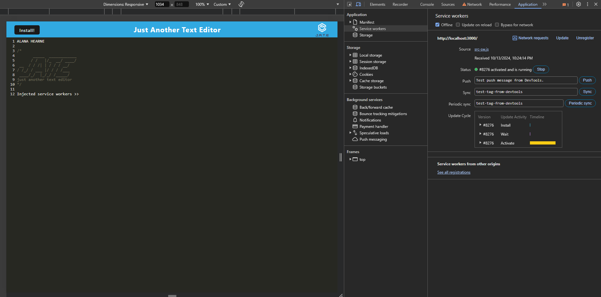
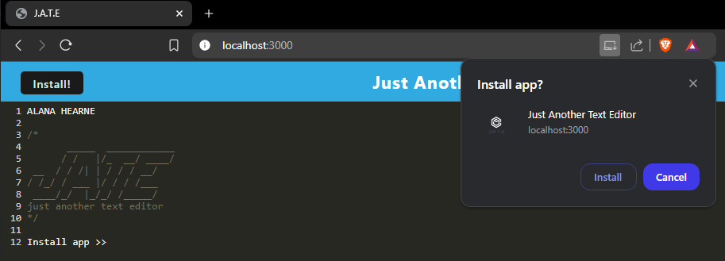
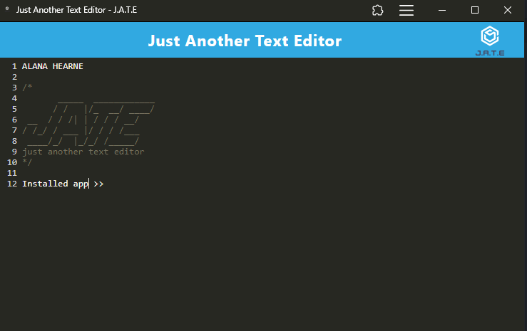

# pwa-text-editor


19-PWA/02-Challenge - Simple Text Editor

## Description

The **PWA Text Editor** is a progressive web application (PWA) designed to offer a simple yet powerful text editing experience. The app can be installed on any device, works offline, and saves text both in IndexedDB and local storage for persistent use. This project demonstrates the use of service workers, caching, and IndexedDB to create a seamless offline experience, making it an ideal tool for writing notes, drafting code, or any other text-based tasks.

Project executed in accordance with the following challenge requirements:

### User Story

```md
AS A developer
I WANT to create notes or code snippets with or without an internet connection
SO THAT I can reliably retrieve them for later use
```

### Acceptance Criteria

```md
GIVEN a text editor web application
WHEN I open my application in my editor
THEN I should see a client server folder structure
WHEN I run `npm run start` from the root directory
THEN I find that my application should start up the backend and serve the client
WHEN I run the text editor application from my terminal
THEN I find that my JavaScript files have been bundled using webpack
WHEN I run my webpack plugins
THEN I find that I have a generated HTML file, service worker, and a manifest file
WHEN I use next-gen JavaScript in my application
THEN I find that the text editor still functions in the browser without errors
WHEN I open the text editor
THEN I find that IndexedDB has immediately created a database storage
WHEN I enter content and subsequently click off of the DOM window
THEN I find that the content in the text editor has been saved with IndexedDB
WHEN I reopen the text editor after closing it
THEN I find that the content in the text editor has been retrieved from our IndexedDB
WHEN I click on the Install button
THEN I download my web application as an icon on my desktop
WHEN I load my web application
THEN I should have a registered service worker using workbox
WHEN I register a service worker
THEN I should have my static assets pre cached upon loading along with subsequent pages and static assets
WHEN I deploy to Render
THEN I should have proper build scripts for a webpack application
```

## Table of Contents

- [Installation](#installation)
- [Usage](#usage)
- [Features](#features)
- [Technologies Used](#technologies-used)
- [License](#license)
- [Credits](#credits)

## Installation

### Local Installation

1. Clone the repository [https://github.com/ajhearne-mZAOSW/pwa-text-editor.git](https://github.com/ajhearne-mZAOSW/pwa-text-editor.git) to your local machine:

    ```md
    git clone https://github.com/ajhearne-mZAOSW/pwa-text-editor.git
    ```

2. Navigate to the project directory and open in an IDE:

    ```md
    cd pwa-text-editor
    code .
    ```

3. Install the necessary dependencies:

    ```md
    npm install
    ```

4. Build the project and start the server:

    ```md
    npm run start
    ```

5. Open the application in your browser at [http://localhost:3000](http://localhost:3000).

## Usage

- **Online**: Access the app via the browser, add, edit, and save text seamlessly at [https://pwa-text-editor-ksm7.onrender.com/](https://pwa-text-editor-ksm7.onrender.com/)
- **Offline**: The app will continue to function offline using cached assets and IndexedDB for persistent data storage.
- **Install**: You can install the app directly from your browser for easy access as a desktop or mobile application.

The following images show the web application's appearance and functionality:







### Steps to Install as a PWA

1. When visiting the app in your browser, you will see an "Install" option in the URL bar.
2. Click on "Install" to add it as a standalone app on your device.
3. Once installed, you can launch it like a native application.

## Features

- **Offline Functionality**: The app continues to work without an internet connection by leveraging service workers and local caching.
- **IndexedDB Integration**: Text data is saved in the browser’s database and can be retrieved when the app is reloaded.
- **Local Storage Backup**: The app saves your last session text in local storage to ensure that data isn't lost.
- **Responsive Design**: The application is fully responsive and works on different devices and screen sizes.
- **Installable**: This app can be installed as a PWA and runs just like a native application on desktop and mobile.

## Technologies Used

- **Node.js**: JavaScript runtime environment
- **Express.js**: Web application framework for Node.js
- **Webpack**: Module bundler for JavaScript files
- **Babel**: JavaScript compiler
- **Service Workers**: Used to cache files and enable offline use
- **IndexedDB**: Browser database for storing text data
- **Local Storage**: Backup for text persistence
- **PWA Features**: Installation and offline support

## License

This project is licensed under the MIT License. See the [LICENSE](./LICENSE) file for details.

## Credits

- Starter code provided by University of Sydney, USYD-VIRT-FSF-PT-05-2024-U-LOLC/19-PWA/02-Challenge/Develop
- Learning foudation provided by University of Sydney, USYD-VIRT-FSF-PT-05-2024-U-LOLC/19-PWA/01-Activities
